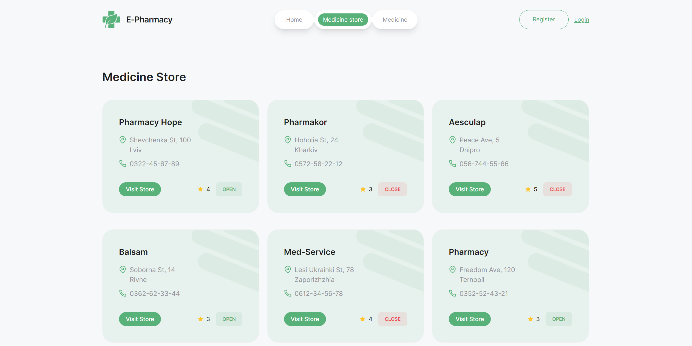

# E-PHARMACY

"E-Pharmacy" is a streamlined and accessible web application aimed at helping users easily search for, compare, and purchase medicines from pharmacies nearby. With user authentication, dynamic search, and responsive design, E-Pharmacy provides a smooth experience for users to locate and order essential medicines at their convenience.

### Pages

**1. Authentication Pages: RegisterPage & LoginPage**

These pages handle user authentication within the application, providing interfaces for user registration and login.

**1. Home**

The HomePage includes the following sections:

Main Banner: Features a primary promo message, "Your medication delivered," with a subtext, "Say goodbye to all your healthcare worries with us."
Promo Banners: Three promotional banners:
Huge Sale: 70% discount with a "Shop now" button.
Secure Delivery: 100% guarantee with a "Read more" button.
Off: 35% discount with a "Shop now" button.
Medicine Stores: Displays six nearby stores with details like name, address, phone number, and open/closed status. Clicking on a store redirects users to the Shop page for more information.
Add Pharmacy Promo: Encourages pharmacies to join the platform, showcasing features like managing orders, creating profiles, and increasing sales.
Reviews Section: Showcases customer reviews, each including a user photo, name, and testimonial, fetched from the backend API.

<!--
- Welcomes users with a site title, company slogan, and a call-to-action button redirecting to the "Events" page. -->

**2. Medicine store page**

<!-- - Each event card includes essential details, a "Register" button for users to sign up for the event, and a "View" button to see who has registered for that event.
- Detailed information about each event is available, including the event title, date, description, and organizer.
- Supports sorting of events by date (newest/oldest), title (A-Z/Z-A), and organizer (A-Z/Z-A).
- Implements infinite scrolling to load events dynamically as the user scrolls down the page. -->

**3. Medicine page**

<!-- - Private page accessible to authenticated users.
- Displays a schedule of all events the user has registered for. -->

**Description**:

<!--
- Provides a user-friendly form for event registration.
- Form validation ensures accurate and complete user input. -->

**Reviews**:

<!-- - Allows users to view a list of registered participants for each event.
- Enables search by full name or email for easy navigation.
- Presents bar charts showing registrations per last week, offering insights into event popularity trends. -->

**4. Cart page**

- Private page accessible to authenticated users to view and manage selected products.
- Users can enter shipping information including name, email, phone number, and address, choose a payment method include "Cash On Delivery" and "Bank".
- The total order amount is displayed, with a "Place order" button to finalize the purchase.
- In products list displays the product name, unit price, quantity with an option to edit, and a "Remove" button to delete the item.
- If the cart is empty, users are prompted to visit the Medicine page to add products.

## Features

- **User Authentication**: Secure login, registration, and logout functionalities powered by Node.js.
- **Adaptive Design**: Fluid layout for breakpoints at 320px, 375px, 768px, and 1440px. Ensures compatibility and usability across various devices.
- **Modal Dialogs**: Enhanced interaction through modal dialogs for login, registration and logaut.
- **Form Validation**: Implemented using React Hook Form and Yup for client-side validation.

## About the Project

[**Layout**](<https://www.figma.com/file/qrKzOBVqM6zOZNFkTOpEO0/E-PHARMACY-(clients)?type=design&node-id=0-1&mode=design&t=O9kTuPJAS2bjEuwM-0>) |
[**Technical Task**](https://docs.google.com/spreadsheets/d/1TdZTkbTSEcscopFAAH1XiiAbkP8IOawIugpvaG9xnuw/edit?gid=0#gid=0)

## Technologies Used

## Deployment

- This project is deployed on Vercel. Check it out: [**E-Pharmacy**](https://e-pharmacy-rust.vercel.app/)
- Here you can see back-end part of website: [**E-Pharmacy backend**](https://github.com/NiukaloTetiana/e-pharmacy-backend)

Discover and order medicines effortlessly with "E-Pharmacy", your trusted partner in healthcare accessibility.
